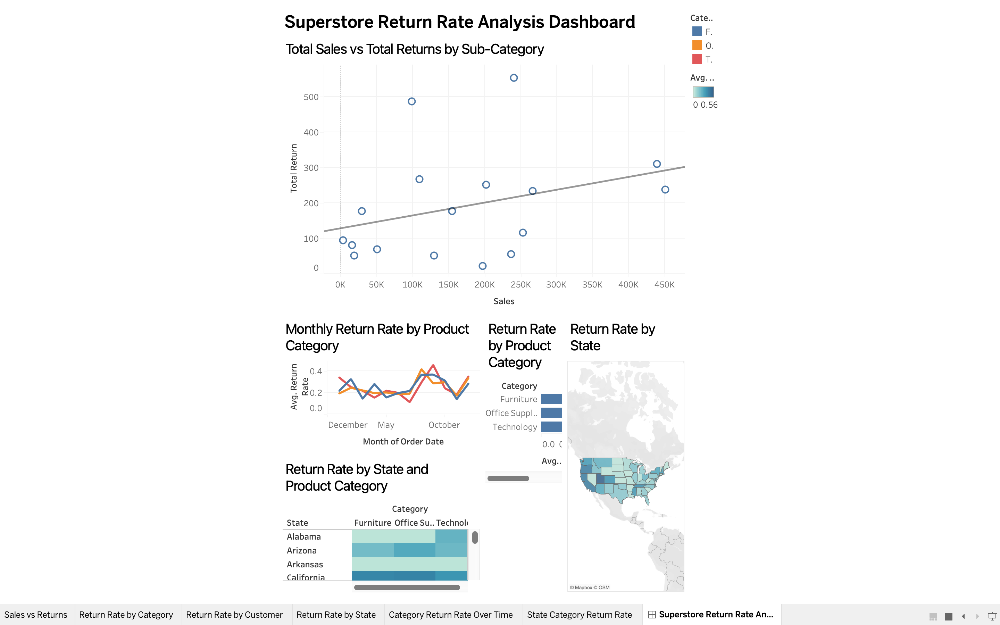

# Superstore Return Rate Analysis Dashboard

## Project Overview

This Tableau project analyzes customer returns in the Superstore
dataset. The dashboard helps users monitor return rates and identify
patterns by product category, sub-category, state, and time.

## Dashboard Preview

**Live Tableau Dashboard:**\
https://public.tableau.com/views/SuperstoreReturnRateAnalysisDashboard/SuperstoreReturnRateAnalysisDashboard?:language=en-US&publish=yes&:display_count=n&:origin=viz_share_link

## Business Objective

The goal is to understand where returns occur most frequently and
provide an interactive dashboard for investigating potential return
drivers.

The analysis focuses on:

- Return rates
- Sales versus returns
- Product categories and sub-categories
- Geographic differences
- Return-rate trends over time
- State-and-category return patterns
## Dashboard Components

### Sales vs. Returns by Sub-Category

A scatter plot comparing total sales with total returns across product
sub-categories. Use it to identify sub-categories with high sales and
unusually high returns.

### Return Rate by Product Category

Compares average return rates across Furniture, Office Supplies, and
Technology. Use it to identify categories that need deeper
investigation.

### Return Rate Over Time

A monthly line chart showing changes in average return rate. Use it to
identify unusually high or low months and possible seasonal patterns.

### Return Rate by Customer

Ranks customers by return rate. Use it to identify customers with
unusually high return rates and investigate their purchasing patterns.

### Return Rate by State

A geographic map showing average return rate by state. Use it to
identify geographic areas with relatively high return rates.

### State × Category Heat Map

Compares return rates across states and product categories. Higher-value
cells can help narrow the analysis to specific state-and-category
combinations.

## How to Use the Dashboard

1.  Start with the Sales vs. Returns view.
2.  Identify a sub-category with a high return level.
3.  Check the category and monthly trend.
4.  Examine the state map.
5.  Use the State × Category heat map to locate concentrated patterns.
6.  Review customers with unusually high return rates.
7.  Investigate the underlying operational or product factors before
    taking action.

## Measuring Returns

No single metric answers every business question.

**Return rate** is best for comparing categories, states, customers, and
time periods because it accounts for differences in order volume.

**Total number of returns** is useful for understanding the absolute
volume and operational workload.

**Total return cost or financial impact** is useful for prioritizing
issues based on business impact.

**Recommended approach:** use return rate as the primary comparison
metric, supported by return volume and financial impact when
prioritizing actions.

## Potential Root Causes to Investigate

The dashboard identifies patterns but does not prove the cause of a
return. High-return areas should be investigated for: - Product quality
or defects - Product descriptions and customer expectations - Packaging
or shipping damage - Fulfillment or logistics issues - Product-specific
problems - Geographic shipping or handling patterns - Seasonal changes
in purchasing behavior

## Recommended Business Actions

After identifying a high-return area: 1. Review the products and
sub-categories involved. 2. Examine customer feedback and return reasons
when available. 3. Review packaging, fulfillment, and shipping
processes. 4. Determine whether the issue is concentrated by state or
time period. 5. Work with product, operations, and logistics teams on
corrective actions. 6. Continue monitoring the dashboard to measure
improvement.

## Key Takeaway

The dashboard brings together sales versus returns, product category comparisons, geographic patterns, and trends over time to help identify areas for further investigation. These visualizations support data-driven decisions by helping Superstore prioritize products, locations, and time periods for a closer review of return activity.

## Tools & Skills

-   Tableau Public
-   Data visualization
-   Dashboard design
-   Calculated fields
-   Return-rate analysis
-   Geographic analysis
-   Time-series analysis
-   Heat maps
-   Scatter plots
-   Interactive filtering
-   Business analysis

## Data

The project uses the Superstore dataset containing order, customer,
product, geographic, and return information.

## Author

**Tracy Crespo**

Business Analytics Project
